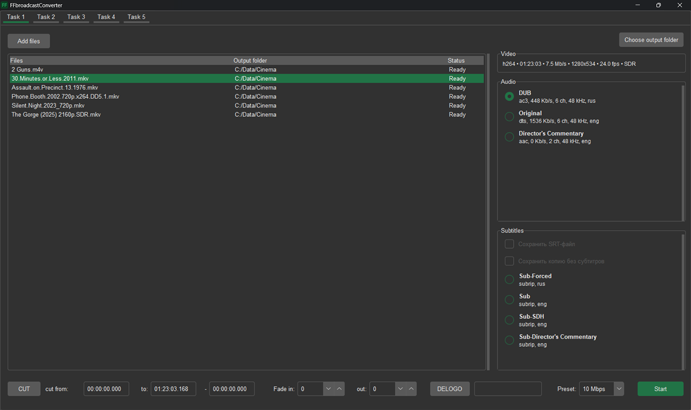

# FFbroadcastConverter

## Overview

Professional video conversion tool designed specifically for TV broadcasting company, featuring a Tkinter GUI and FFmpeg backend. Built to comply with broadcasting standards and regulations.

## Key Features

- **Multi-Queue System**: Manage 5 independent rendering queues simultaneously
- **Broadcast Compliance**:
  - Audio normalization using EBU R128 standard (compliance with broadcasting laws)
- **High Performance**:
  - Multi-threaded processing
  - NVIDIA CUDA acceleration
  - Multi-GPU support with automatic queue distribution
- **Precision Editing**:
  - Timecode-based video trimming
  - Audio track selection
  - Subtitle options:
    - Hardsub (burned-in subtitles)
    - Separate SRT file export
- **TV-Optimized Workflow**: 
  - Specialized features for broadcasting requirements
